# StreamPETR + TTC Risk Head

Frozen StreamPETR detector with a lightweight MLP head that predicts time-to-collision (TTC) in seconds on nuScenes.

## What it Does

<p align="center">
  
</p>

This project uses time-to-collision (TTC) as a risk metric for autonomous driving and evaluates it on the [nuScenes](https://www.nuscenes.org/) dataset with StreamPETR as the 3D perception backbone. Ground-truth TTC is built from physics-based labels. We then compare two predictors: a physics baseline that feeds StreamPETR’s outputs through the same closure model used for labeling, and a TTC head trained on top of a frozen StreamPETR so the network regresses seconds-to-collision directly from object query features—giving you both an interpretable baseline and a learned risk estimate from the same detections.

<p align="center">
  
</p>

## Quick Start

1. **[SETUP.md](SETUP.md)** — environment, nuScenes layout, temporal infos, TTC label pickle, and StreamPETR weights in `ckpts/`.
2. **Train (Slurm):** `sbatch ttc_mlp_head.sh` (1 GPU) or `sbatch ttc_mlp_head_4gpu.sh` — set `NUSCENES_ROOT` and related env vars as documented there.
3. **Eval (Slurm):** `CHECKPOINT=work_dirs/.../latest.pth sbatch run_eval_ttc_mlp.sh` for mini val; `sbatch run_eval_ttc_mlp_full.sh` for full val (optional `NUSCENES_ROOT`).

## Video Links

- **Demo:** *[ADD DEMO VIDEO URL HERE]*
- **Technical walkthrough:** *[ADD TECHNICAL WALKTHROUGH HERE]*

## Data

Used [nuScenes](https://www.nuscenes.org/) autonomous driving dataset. It consists of about **1,000 scenes of 20 s each**, on the order of **1,400,000** camera images and **390,000** LiDAR sweeps, recorded in **Boston and Singapore** with both **left- and right-hand** traffic. In this repo,  **v1.0-mini** is used for quick tests and **v1.0-trainval** for full experiments.

<p align="center">
  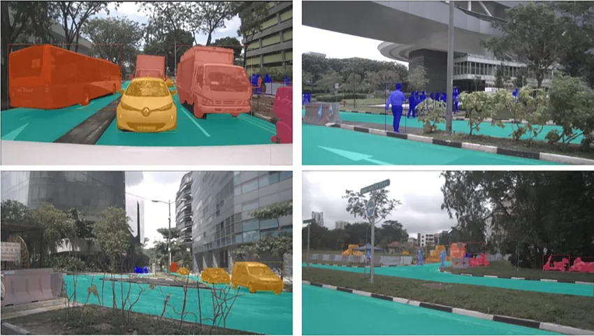
</p>


| Split | Pkl filename                          | Keyframes           |
| ----- | ------------------------------------- | ------------------- |
| train | `nuscenes2d_temporal_infos_train.pkl` | 28,130 (700 scenes) |
| val   | `nuscenes2d_temporal_infos_val.pkl`   | 6,019 (150 scenes)  |
| test  | `nuscenes2d_temporal_infos_test.pkl`  | 6,008 (150 scenes)  |

**TTC supervision (labels, `LoadGTTC`, matching, loss):** see **[docs/ttc_supervision_pipeline.md](docs/ttc_supervision_pipeline.md)**.


# Evaluation

## Protocol

All quantitative results below are from `eval_ttc_breakdown.py` on `v1.0-trainval` val infos with `TTC_MAX_BATCHES=1000`. Two evaluation scripts are used and reported separately:

- `eval_ttc_breakdown` — per-pair MAE and RMSE between predicted TTC and GT TTC, matched by annotation token
- `eval_ttc_mlp` — mean sum of `loss_ttc` terms per batch (includes the loss weighting scheme)

The **physics baseline** applies the same closure model used to generate labels (`distance / closing_speed`, capped at 10 s) to StreamPETR's predicted boxes and velocities. All comparisons are against GT TTC derived from `generate_ttc_labels.py`.

---

## 1. Primary Ablation Study

> Key questions:
>
> 1. Does the learned head improve over the physics heuristic, and by how much?
> 2. TTC Head design: Does adding velocity to the head improve performance?


| Predictor                                    | n_pairs | MAE (s) | RMSE (s) | Mean error (s) |
| -------------------------------------------- | ------- | ------- | -------- | -------------- |
| Physics baseline                             | 1465    | 1.4776  | 2.4393   | -0.1763        |
| MLP head (Only using query embeddings)       | 2779    | 3.5727  | 3.9535   | -2.6170        |
| MLP head (Using query + velocity embeddings) | 2780    | 1.7131  | 2.6360   | -0.5908        |


<p align="center">
  <figure>
    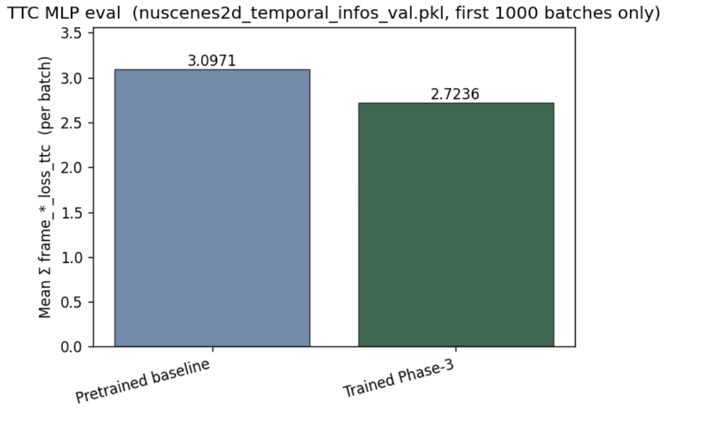
    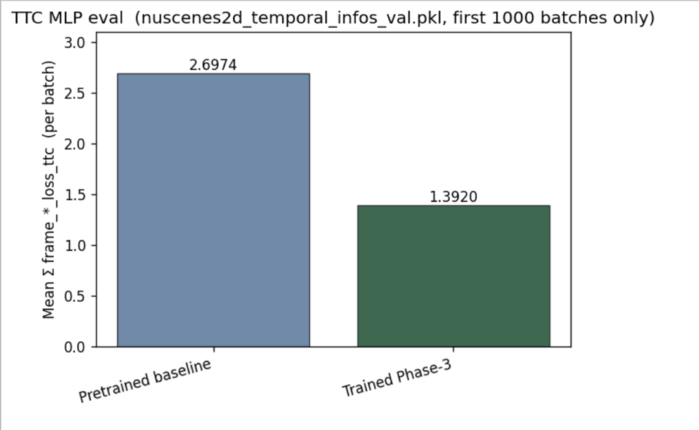
    <figcaption align="center"><em>Training loss (mean Σ frame × loss_ttc per batch) for MLP query-only (left) and MLP query + velocity (right). Lower is better. Trained TTC head with query + velocity embeddings shows clear improvement over the pretrained baseline.</em></figcaption>
  </figure>
</p>
---

## 2. Conditional breakdown by GT TTC bin

> Key question: does the MLP head outperform the physics baseline in the safety-critical short bins ([0, 1) and [1, 3))?

Results split by GT TTC bin, aligned with the loss tiers used during training. The [0, 1) bin has very few samples since not many scenes have that close of a collision range. Ideally, in the future would test on a dataset that includes collision simulations.


| GT TTC bin (s)   | n                 | Physics MAE / RMSE | Query only MAE / RMSE | Query + Vel MAE / RMSE |
| ---------------- | ----------------- | ------------------ | --------------------- | ---------------------- |
| [0, 1)           | 2 / 4 / 4         | 0.4619 / 0.5864    | 4.2869 / 4.2893       | 3.7994 / 4.5083        |
| [1, 3)           | 246 / 278 / 278   | 1.1308 / 1.8889    | 2.9299 / 2.9828       | 1.8459 / 2.9992        |
| [3, 10)          | 674 / 942 / 942   | 1.9718 / 2.6098    | 1.5935 / 1.9993       | 2.5030 / 3.0331        |
| [10, ∞) (capped) | 543 / 1555 / 1556 | 1.0251 / 2.4458    | 4.8847 / 4.8861       | 1.2058 / 2.2772        |


---

## 3. Per-class breakdown

MAE per object class for both predictors. Pedestrians and cyclists involve more complex motion that the simple closing-speed model may struggle with; cones and barriers are nearly static and should be near the 10 s cap.


| Class      | n                  | Physics MAE (s) | Query only MAE (s) | Query + Vel MAE (s) |
| ---------- | ------------------ | --------------- | ------------------ | ------------------- |
| car        | 1024 / 1419 / 1419 | 1.8526          | 2.7157             | 2.3653              |
| pedestrian | 298 / 1065 / 1066  | 0.1651          | 4.7920             | 0.7202              |
| bicycle    | 8 / 19 / 19        | 2.1185          | 1.9661             | 2.7330              |
| motorcycle | 3 / 29 / 29        | 0.6615          | 3.6345             | 1.6930              |
| truck      | 87 / 154 / 154     | 1.4307          | 3.1783             | 2.4518              |
| bus        | 40 / 76 / 76       | 1.7249          | 3.6607             | 1.6739              |
| trailer    | 5 / 17 / 17        | 1.2152          | 3.5900             | 1.9083              |

<p align="center">
  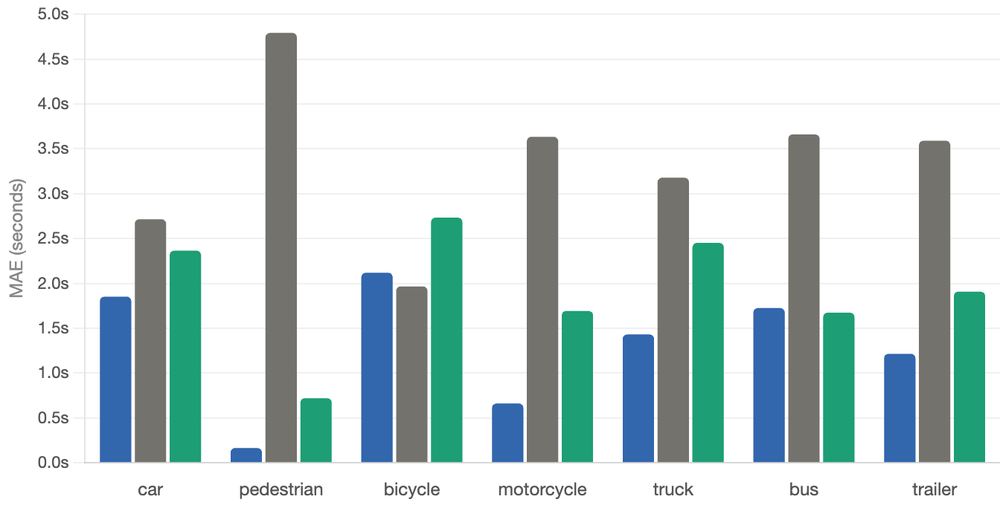
</p>


---

## 4. Qualitative evaluation

Four scenes chosen to stress-test different driving regimes. Each panel shows CAM_FRONT with TTC-colored bounding boxes annotated with three values per object: GT / physics / MLP. BEV panels shown where available.

1. Intersection scene (lots of moving cars in different directions, crossing intersection at a green light)

<p align="center">
  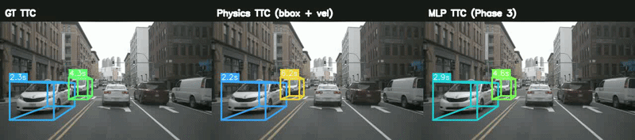
</p>

<p align="center">
  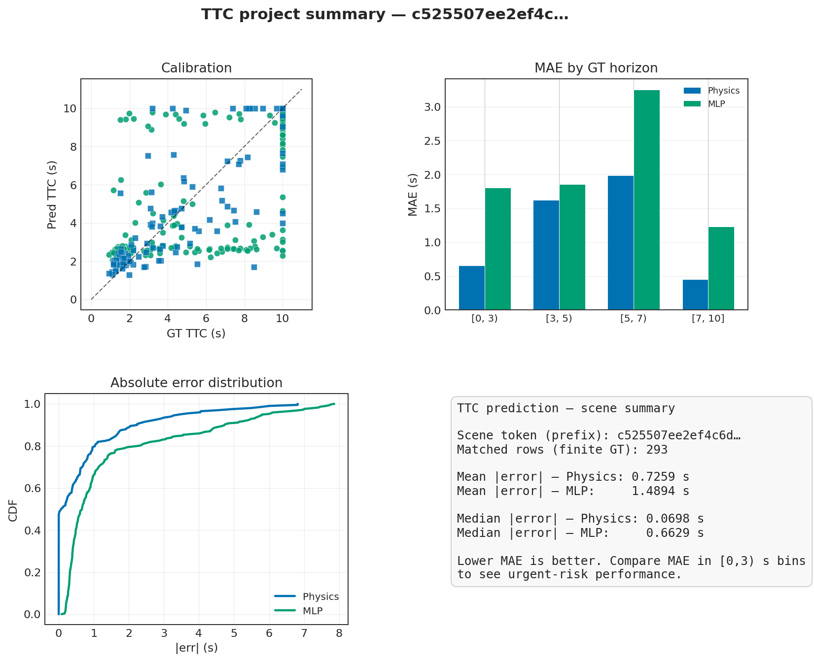
</p>


2. Straight-away scene (not much cross-traffic, cars all moving same direction)

<p align="center">
  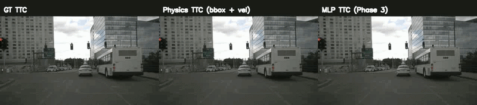
</p>

<p align="center">
  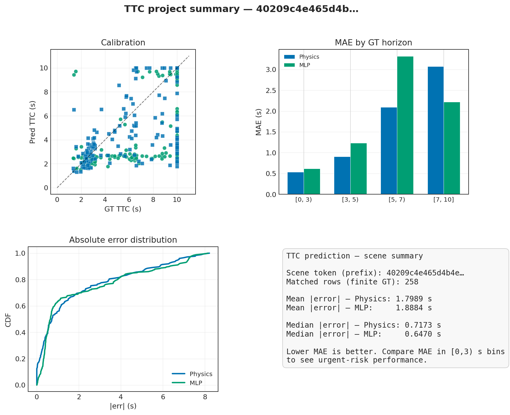
</p>

3. Parking scene (not many cars, car is slowing to a stop)

<p align="center">
  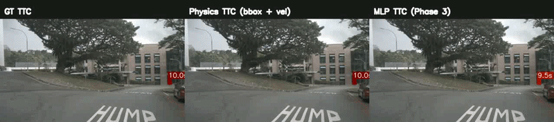
</p>

<p align="center">
  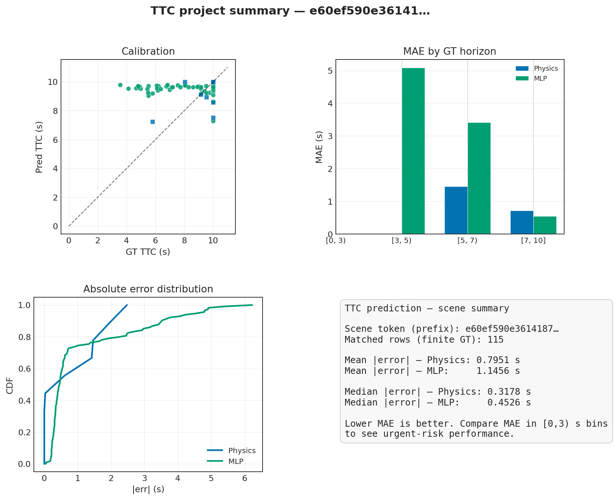
</p>

4. Lots of barriers (Car has lots of objects with low TTC range)

<p align="center">
  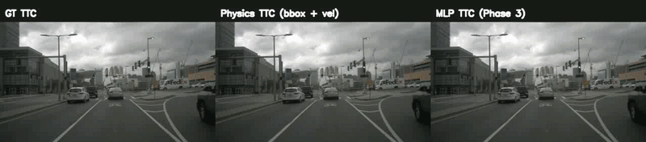
</p>

<p align="center">
  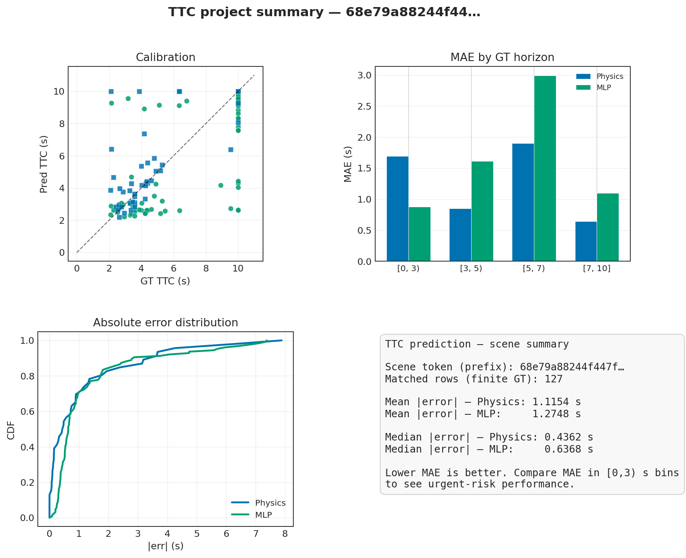
</p>


Based on [StreamPETR](https://github.com/exiawsh/StreamPETR) (ICCV 2023).

```bibtex
@article{wang2023exploring,
  title={Exploring Object-Centric Temporal Modeling for Efficient Multi-View 3D Object Detection},
  author={Wang, Shihao and Liu, Yingfei and Wang, Tiancai and Li, Ying and Zhang, Xiangyu},
  journal={arXiv preprint arXiv:2303.11926},
  year={2023}
}
```

