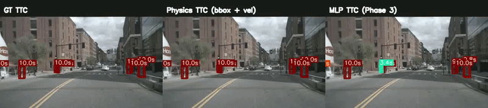

# StreamPETR + TTC Risk Head

Frozen StreamPETR detector with a lightweight MLP head that predicts time-to-collision (TTC) in seconds on nuScenes.

## What it Does

<p align="center">
  
</p>

This project uses time-to-collision (TTC) as a risk metric for autonomous driving and evaluates it on the [nuScenes](https://www.nuscenes.org/) dataset with StreamPETR as the 3D perception backbone. Ground-truth TTC is built from physics-based labels. We then compare two predictors: a physics baseline that feeds StreamPETR’s outputs through the same closure model used for labeling, and a TTC head trained on top of a frozen StreamPETR so the network regresses seconds-to-collision directly from object query features—giving you both an interpretable baseline and a learned risk estimate from the same detections.

<p align="center">
  
</p>

## Quick Start

1. **[SETUP.md](SETUP.md)** — environment, nuScenes layout, temporal infos, TTC label pickle, and StreamPETR weights in `ckpts/`.
2. **Train (Slurm):** `sbatch ttc_mlp_head.sh` (1 GPU) or `sbatch ttc_mlp_head_4gpu.sh` — set `NUSCENES_ROOT` and related env vars as documented there.
3. **Eval (Slurm):** `CHECKPOINT=work_dirs/.../latest.pth sbatch run_eval_ttc_mlp.sh` for mini val; `sbatch run_eval_ttc_mlp_full.sh` for full val (optional `NUSCENES_ROOT`).

## Video Links

- **Demo:** *[ADD DEMO VIDEO URL HERE]*
- **Technical walkthrough:** *[ADD TECHNICAL WALKTHROUGH HERE]*

## Evaluation

Potential things I'll include:

- 3-way comparison - error of MLP TTC vs physics TTC vs GT TTC
- Metrics conditional on GT TTC to align with loss tiers: Under 1s, under 3s, under 5, under 10 maybe?
- By class - is it more accurate for pedestrians (slow moving objects), cars (fast moving objects), cones (unmoving objects)
- V1 vs V2 vs V3 (if i make one??)
- Ablations
  - embeddings only versus embeddings + predicted velocity (V3)
- Qualitative evaluations
  - How does it perform at an intersection, going on a straight-away, in a parking lot
  - Could use the explicit scene comparisons and link BEV/CAM panels

---

Based on [StreamPETR](https://github.com/exiawsh/StreamPETR) (ICCV 2023).

```bibtex
@article{wang2023exploring,
  title={Exploring Object-Centric Temporal Modeling for Efficient Multi-View 3D Object Detection},
  author={Wang, Shihao and Liu, Yingfei and Wang, Tiancai and Li, Ying and Zhang, Xiangyu},
  journal={arXiv preprint arXiv:2303.11926},
  year={2023}
}
```

