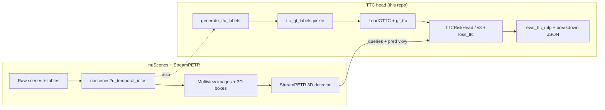

# TTC data pipeline

## Big picture

---

## What each part does

### A — Base StreamPETR

- Camera images + calibrations
- `nuscenes2d_temporal_infos_*.pkl` (how samples line up in time)
- Multiview resize / normalize (standard vision prep)
- 3D detection training

### B — TTC extension

- **Generating Pickle file:** `generate_ttc_labels.py` → one pickle of TTC per annotation (when valid)
- **Train:** `LoadGTTC` After box filters, each GT gets `gt_ttc` or `NaN`
- **Model:** `TTCRiskHead` (embeddings only) **or** `TTCRiskHeadV3` (embeddings + predicted velocity `vx, vy`)
- **Eval:** `eval_ttc_mlp`, `eval_ttc_breakdown` → numbers in JSON under the checkpoint folder

**GT Calculation:**

- If closing speed is too small → **no label**
- Else: TTC = **distance / closing** (BEV), **capped at 10 s**  
- Details: [ttc_labels.md](ttc_labels.md)

---
### Data Issues Outlined

We need to treat TTC differently as it's not a standard classification label since it acts like a ratio-style quantity (range over closing rate). This means it can either blow up or be undefined depending on the specifics of the scenario. That's why we need to make sure to:
1. Define when a number is trustworthy (establish a min closing speed)
2. Align the TTC labels with the matching bounding boxes so that it is training on the correct box-label pairs.
3. Deal with class imbalance: Most objects sit at a longer TTC, however the inherent 'risk' of this is relatively low so we actually want to weight objects that have close-range values of TTC.

| #     | Issue                                                                                                                                                                                                                                     | What we do                                                                                                                                                                   |
| ----- | ----------------------------------------------------------------------------------------------------------------------------------------------------------------------------------------------------------------------------------------- | ---------------------------------------------------------------------------------------------------------------------------------------------------------------------------- |
| **1** | TTC can be **huge or undefined** if the object is barely moving toward ego (small “closing speed”).Examples include:Same-direction traffic, an object moving away or receding, nearly static objects like a parked car or traffic cone | When building labels: only keep objects above a min closing speed; also clip TTC at 10 s.                                                                    |
| **2** | The label file and the boxes we train on are not the same list (we drop some boxes with filters).                                                                                                                                 | `LoadGTTC` runs **after** those filters, **matches** each training box to a label; if it can’t, `gt_ttc` is **NaN** and we **skip** TTC loss for that box. `ttc_pipeline.py` |
| **3** | Most objects have long TTC; few have very short TTC, so a flat loss can ignore the rare “urgent cases."                                                                                                                          | Loss *weights (v2 / v3 configs): count short TTC more, and optionally downweight very high TTC.    |

---

## Documented Impact

Documented impact can be found in the notebook [ttc_data_quality_checks.ipynb](/notebooks/ttc_data_quality_checks.ipynb)

